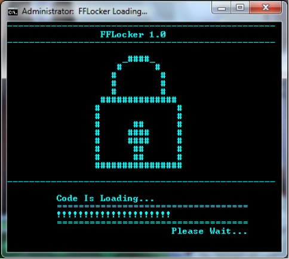

# FFLocker

FFLocker was a fun project when i was learning batch file programming. This was built in 2014 with an idea of locking/unlocking folders/files through batch file. The more fun while building this project was a good GUI. One way other it's not actual GUI it's more of command line but works pretty well to make a user fill like a good UI.

<mark>**Since this was created in 2014, I am not sure how this code behaves in new windows operating system. So please do not use directly on your personal computer, you may try on VM first. If anything goes wrong, I won't be responsible for your loss.**</mark>

## Snapshot(s)

## Versions
- [FFLocker 1.0 ~ Windows 7 And Higher](/setup/FFLocker%201.0%20-%20Win7.bat)
- [FFLocker 1.0 ~ Windows XP](/setup/FFLocker%20Codes-XP.bat)

## Guide
- [FFLocker 1.0 - Guide.pdf](_resources/FFLocker%201.0%20-%20Guide.pdf)
